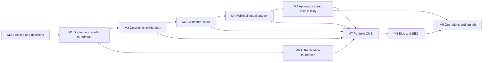

# Project roadmap

Status snapshot: **2026-08-10**

Active milestone: **M0 — Baseline, guardrails, and decisions** (all repository-owned work complete; the gate is held open by one owner action, see §6)

Target: **production-ready bilingual portfolio, blog, and owner-admin platform**

This roadmap is the status and sequencing layer for the project. [PRODUCT_SPEC.md](PRODUCT_SPEC.md) defines the required product, and [IMPLEMENTATION_PLAN.md](IMPLEMENTATION_PLAN.md) contains the detailed task order. A milestone is complete only when its exit gate is demonstrated; merging its last planned feature is not enough.

Calendar dates are intentionally not assigned yet. They depend on delivery capacity and on closing each infrastructure decision before its dependent milestone. Relative sizes in this document compare milestones with each other; they are not commitments.

## 1. Product outcome

The first production release provides:

- a server-rendered portfolio backed by PostgreSQL and editable through the admin panel;
- an English and Persian blog whose canonical article bodies are Markdown files in Git;
- equivalent panel, upload, and direct-push authoring paths through one safe render pipeline;
- site-wide visitor theme selection and blog-only font family and text-size selection;
- secure owner authentication, revisions, audit history, media/resume management, and recovery;
- locale-correct SEO surfaces, reproducible containers, CI security gates, backups, and a proven restore path.

The v1 non-goals in [PRODUCT_SPEC.md](PRODUCT_SPEC.md) §9 remain out of scope. In particular, v1 does not include public accounts, comments, newsletters, real-time collaboration, automatic translation, runtime MDX, or arbitrary uploaded fonts/CSS.

## 2. Current position

Phase 0 stabilization is complete in the repository. One item — revoking the published EmailJS keys at the provider — is an owner action outside the repository and holds the gate open.

| Area                         | Current state                                                                                                                                                     | Roadmap implication                                                                                                                               |
| ---------------------------- | ----------------------------------------------------------------------------------------------------------------------------------------------------------------- | ------------------------------------------------------------------------------------------------------------------------------------------------- |
| Workspace and specifications | pnpm monorepo, package boundaries, lockfile, environment template, and normative specifications exist                                                             | Preserve these boundaries; update specs and ADRs with each superseding decision                                                                   |
| Public application           | The legacy Next.js portfolio is preserved and still reads JSON/hard-coded content, now with `standalone` output, a real `metadataBase`, and a server-computed age | Introduce a server-side rollback adapter before the first cutover, then retain it until migrated output reconciles and the rollback window closes |
| API                          | NestJS/Fastify scaffold exposes only the health route, covered by a real smoke test                                                                               | Domain and security modules start in M1                                                                                                           |
| Contracts and database       | Package manifests and placeholder exports exist; there are no shared domain contracts in `packages/contracts` and no Prisma schema or migrations                  | M1 is the first feature milestone                                                                                                                 |
| Markdown and Git content     | `packages/markdown` and `content/` do not yet exist                                                                                                               | The renderer must be proven before the content store or blog UI                                                                                   |
| Blog and admin               | Feature folders are placeholders; no routes, authentication, or mutation UI exist                                                                                 | No admin mutation work starts before M6 exits                                                                                                     |
| Appearance                   | Runtime uses a client `localStorage` theme; fonts are now `woff2`-only with correct numeric weights, and blog typography is still specification-only              | Implement after the locale-aware server layout exists; M5 adds subsetting and `unicode-range` to the reduced font set                             |
| Operations and quality       | CI runs frozen install, format, lint, typecheck, real tests, builds, and full-history secret scanning; `--passWithNoTests` is gone from every package             | Expand continuously; container, audit, SBOM, and image scanning complete in M9                                                                    |
| Legacy baseline              | [BASELINE_M0.md](BASELINE_M0.md) records the routes, content counts, and SHA-256 hashes of all 137 legacy source and asset files at the pre-stabilization commit  | Frozen. It is the comparison input for the M2 reconciliation and must not be regenerated                                                          |

Two findings from the verification pass carry forward:

- `prettier --check` failed on 48 files before this milestone, so the CI format step could not have passed on any commit. The repository is now formatted, and `.gitattributes` pins LF endings — the CRLF drift in a Windows checkout was both the cause of that failure and the reason `git diff` reported every line of 86 files as changed.
- The legacy content reconciles against the figures already stated in the plan: 14 projects, 6 skill categories, 26 skills, 5 certificates, 35 quotes, and no orphan skill references. M2 inherits a clean starting point plus a test that keeps it that way.

The quality commands have not yet been run from a clean, fully hydrated checkout on a machine with the pinned Node and pnpm; see §6 for what that leaves outstanding.

## 3. Decisions that gate implementation

Each decision below requires an ADR or an explicit amendment to an existing ADR before the dependent implementation begins.

| Decision                                                                                           | Must be closed by                                                               | Why it blocks work                                                                                                            |
| -------------------------------------------------------------------------------------------------- | ------------------------------------------------------------------------------- | ----------------------------------------------------------------------------------------------------------------------------- |
| Per-visitor appearance delivery                                                                    | **Accepted: ADR-009**; prove in M4/M5                                           | Dynamic HTML shell emits cookie-specific attributes while public data/render caches stay shared and appearance-free           |
| Persian slug policy                                                                                | **Accepted: ADR-010**; implement in M1                                          | Unicode Persian is canonical; normalized ASCII transliterations may be redirect aliases                                       |
| Git write branch and protection model                                                              | **Accepted: ADR-011**; prove in M3                                              | Protected dedicated `content` branch is not merged into the deployment branch during normal publishing                        |
| Recovery after Git succeeds but PostgreSQL or invalidation fails                                   | **Accepted: ADR-012**; prove in M3/M4                                           | Durable operation log, idempotent apply ledger, reconciliation, and invalidation outbox                                       |
| MinIO deployment and verified ingestion boundary                                                   | Before M2                                                                       | Certificate/resume migration and later admin media depend on stable media IDs and checksums                                   |
| Public API outage strategy                                                                         | **Accepted: ADR-014**; prove in M4                                              | Bounded last-known-good published DTOs with per-surface maximum stale windows; cold/expired routes fail with controlled `503` |
| Scheduler and sync-worker topology                                                                 | **Accepted: ADR-013**; prove in M3/M8                                           | Dedicated PostgreSQL-backed worker and advisory-lock scheduler; API replicas run no timers                                    |
| Hosting/reverse proxy, monitoring, retention defaults, analytics choice, and v1 editor permissions | Deadlines assigned in `DECISIONS.md`; each blocks its first dependent milestone | These choices affect adapters, privacy, authorization, runbooks, and final deployment                                         |

## 4. Delivery map

M6 may run alongside M2–M5 once M1 is stable. M7 API/domain work may begin after M2 and M6, but its UI uses the M5 design-system boundary, its content-store-health slice needs M3, and its end-to-end invalidation gate needs M4. For a single developer, follow the numbered order unless switching tracks removes a genuine external blocker.

Two dependencies are non-negotiable:

1. The Markdown parser, sanitizer, and security corpus pass before the Git content store accepts content.
2. The Git content store is proven before blog authoring and lifecycle UI are built on it.

## 5. Milestone summary

| Milestone                                | Status      | Relative size | Outcome                                                                                                              | Depends on         |
| ---------------------------------------- | ----------- | ------------- | -------------------------------------------------------------------------------------------------------------------- | ------------------ |
| M0 — Baseline, guardrails, and decisions | In progress | S             | Verified scaffold, urgent risk cleanup, starter CI, and closed architectural blockers                                | —                  |
| M1 — Trusted domain and media foundation | Not started | XL            | Shared contracts, Prisma schema/migrations, safe Markdown pipeline, and verified media identity/ingestion primitives | M0                 |
| M2 — Deterministic legacy migration      | Not started | M             | Repeatable legacy portfolio/media migration with reconciliation and rollback                                         | M1                 |
| M3 — Git content-store proof             | Not started | L             | Secure Git writes, webhook sync, reconciliation, and drift recovery                                                  | M1, M2             |
| M4 — Public bilingual cutover            | Not started | XL            | Published-only API reads become the default, with locale routing, SSR navigation, and an isolated rollback adapter   | M2, M3             |
| M5 — Appearance and accessibility        | Not started | M             | Flash-free site theme, blog-only typography, reduced motion, and tokenized colours                                   | M4                 |
| M6 — Authentication foundation           | Not started | L             | Owner provisioning, passkeys, sessions, CSRF, authorization, and audit baseline                                      | M1                 |
| M7 — Portfolio CMS                       | Not started | XL            | Every non-blog portfolio field, translation, media item, and resume manageable through admin                         | M2, M3, M4, M5, M6 |
| M8 — Blog authoring, publishing, and SEO | Not started | XL            | Editor/import/direct-push parity, lifecycle and scheduling, discovery, and locale SEO                                | M3, M4, M6, M7     |
| M9 — Operations, release, and cleanup    | Not started | L             | Operational contact/media controls, reproducible deployment, restore drill, launch, and rollback-window cleanup      | M5, M8             |

The detailed plan maps to these milestones as follows: M0 pulls forward the Phase 0 cleanup and starter CI; M1 is Phase 1 plus the media foundation needed by migration; M2 is Phase 2; M3 is Phase 2.5; M4 is Phase 3 plus the public contact replacement; M5 is Phase 3.5; M6 is Phase 4; M7 is Phase 5 plus upload hardening; M8 is Phase 6; and M9 completes Phases 7–9. This mapping is authoritative when the older phase grouping would defer a prerequisite until after its consumer.

## 6. Milestones and exit gates

### M0 — Baseline, guardrails, and decisions

Objective: make the scaffold reproducible and remove immediate risks before domain code compounds them.

Deliverables:

- run frozen install, format check, lint, typecheck, tests, and production builds from a clean checkout;
- add a minimal CI workflow and at least one real smoke test; remove `--passWithNoTests` package by package as real suites land;
- capture the original legacy routes, source hashes, content counts, and screenshots before correcting any source path or removing any font file;
- set `metadataBase` and standalone output, use Zod as the single API validation stack, declare or move the birthday value server-side, correct certificate path casing, and reduce unused font formats after verifying the active faces;
- revoke and rotate the already-published EmailJS credentials at the provider immediately; in the same change, remove/disable the client integration and show an honest temporary unavailable state until M4 supplies the server contact path;
- close the decisions needed by M1–M3, assign a decision deadline before each later dependent milestone, and update the affected specifications.

Exit gate:

| Condition                                                                          | Status                         | Evidence                                                                                                                                                                                                                                                                                                                                                                          |
| ---------------------------------------------------------------------------------- | ------------------------------ | --------------------------------------------------------------------------------------------------------------------------------------------------------------------------------------------------------------------------------------------------------------------------------------------------------------------------------------------------------------------------------- |
| The existing web and API builds pass from a clean checkout                         | **Outstanding**                | Formatting, JSON/YAML validity, asset resolution, and the age logic were verified directly, and no type or syntax errors were found in the changed files. The pinned toolchain has not yet been exercised end to end; run `pnpm install --frozen-lockfile && pnpm format:check && pnpm lint && pnpm typecheck && pnpm test && pnpm build` on Node 24.13 / pnpm 11.9 to close this |
| Starter CI blocks a broken build and does not report a false green from zero tests | **Met**                        | `.github/workflows/ci.yml` runs format, lint, typecheck, tests, and builds; `--passWithNoTests` is removed from every package and `apps/web` has real suites                                                                                                                                                                                                                      |
| Exposed EmailJS credentials are confirmed revoked                                  | **Outstanding — owner action** | Deferred at the owner's request. The keys ship in the client bundle via `NEXT_PUBLIC_`, so anyone can send mail through the account until they are rotated at the provider. Deleting them from source would not help; only revocation does                                                                                                                                        |
| Every decision needed by M1–M3 has an accepted ADR and named follow-up milestone   | **Met**                        | ADR-003 through ADR-014 in [DECISIONS.md](DECISIONS.md), each with its proving milestone recorded in §3                                                                                                                                                                                                                                                                           |

Two guardrails were added beyond the original deliverables, because the first exit condition could not otherwise be met:

- the repository is formatted and `prettier --check` passes; it failed on 48 files beforehand, which would have made the CI format step red on every commit;
- `.gitattributes` pins LF line endings, removing the CRLF drift that caused formatting to behave differently in a Windows checkout than in CI.

### M1 — Trusted domain and media foundation

Objective: build the validated domain and media trust layer every later write, migration, and render path depends on.

Deliverables:

- shared Zod contracts for IDs, locales, errors, pagination, auth, content, appearance, and blog commands;
- Prisma schema, reviewed migrations, generated client wrapper, transaction helpers, test database, and deterministic seed;
- startup validation for all runtime configuration and secrets;
- `packages/markdown` with frontmatter parsing, deterministic serialization, restricted directives, sanitization, heading extraction, Shiki output, and restricted inline Markdown for portfolio prose;
- the chosen MinIO adapter with verified MIME detection, hashing, stable media IDs, safe names, and a local/test implementation for migration;
- security corpora for XSS, unsafe links, YAML abuse, path traversal, unknown directives, and malformed input;
- CI checks for contracts, migration validation, renderer tests, dependency/secret scanning, lint, typecheck, and builds.

Exit gate:

- a clean database migrates from zero and seeds deterministically;
- frontmatter round-trips without semantic drift;
- the renderer and all security corpora pass;
- public/browser packages cannot import the database client or server secrets.

### M2 — Deterministic legacy migration

Objective: move legacy portfolio data without losing fidelity, using the media primitives proven in M1.

Deliverables:

- implement a versioned, idempotent migration command for JSON, hard-coded fields, resume, certificate PDFs, and public assets;
- seed English translations, preserve legacy IDs, normalize approved enums/URLs/dates, and generate collision reports rather than silently coercing;
- emit a reconciliation report with counts, byte comparisons, checksums, orphan checks, path-case checks, and explained encoding differences;
- introduce a server-side legacy-read adapter and rollback flags before cutover, then retain them until the post-launch rollback window closes.

Exit gate:

- the counts and checksums in [CONTENT_INVENTORY.md](CONTENT_INVENTORY.md) §15 reconcile exactly;
- there are zero orphan skill references, case-mismatched paths, silent enum coercions, unsafe URLs, or unexplained warnings;
- rerunning the same migration produces no unintended changes;
- switching back to legacy reads remains possible.

### M3 — Git content-store proof

Objective: prove Git-backed article integrity and recovery before any editor depends on it.

Deliverables:

- GitHub App authentication with least privilege, content-prefix enforcement, safe commit metadata, branch protection, and blob-SHA `If-Match` writes;
- signed/replay-protected webhook, per-post serialization, sync worker, reconciliation job, sync log, and drift visibility;
- explicit idempotent recovery for Git-success/database-failure and invalidation-failure cases;
- failure tests for forged webhooks, stale SHA, invalid/deleted files, path escape, Git outage, and forced database failure after a successful commit;
- secret scanning on the content branch before automated or direct content commits are accepted;
- one real article in both locales added by direct push and reconciled into the read index.

Exit gate:

- a valid push appears in the indexed render cache without deployment; end-to-end route invalidation is proven in M4;
- invalid or deleted repository content does not change live output or silently unpublish;
- a forced partial failure converges through retry/reconciliation without duplicate state;
- Git unavailability blocks authoring only, not public reads or database-driven publication state.

### M4 — Public bilingual cutover

Objective: make cache-safe, locale-explicit server rendering the default public path while retaining an isolated rollback adapter.

Deliverables:

- published/enabled-only public DTOs and API endpoints with ETags, locale-scoped cache tags, and exclusion of every non-`SYNCED` article translation from public discovery;
- typed server-side Next.js API client with bounded timeouts and the chosen outage behavior;
- `/[locale]/` routing, one-hop legacy `308` redirects, dynamic `lang`/`dir`, message catalogs, and bidi-safe shared components;
- server-rendered navigation, metadata/canonical foundations, and a minimal read-only route proving the seeded bilingual article; complete blog discovery surfaces remain in M8;
- section-by-section migration behind feature flags, comparing rendered output before removing each JSON import;
- server-side cached GitHub statistics and draft/cross-locale leakage tests;
- server-side SMTP contact submission with validation, layered anti-abuse controls, a generic response, and no browser/provider credential.

Exit gate:

- the active production path has no component import from `src/DataBase`; the dormant legacy adapter is reachable only through the tested server-side rollback flag;
- English and Persian routes render with correct direction; missing Persian portfolio fields deliberately fall back to English, while a missing article translation returns `404` without fallback;
- every legacy URL redirects exactly once;
- navigation is present in initial HTML and the tested outage behavior is consistent;
- public caches/listings never contain draft, preview, scheduled, archived, non-`SYNCED`, or cross-locale content;
- content publication/invalidation reaches the rendered route end to end;
- contact submission works without browser credentials and passes its baseline abuse tests.

### M5 — Appearance and accessibility

Objective: establish the final design-system boundary before UI surface area grows further.

Deliverables:

- static theme tokens and blog-font registry; remove hard-coded component colours and add enforcement;
- cookie-backed, server-compatible theme resolution with no first-paint flash;
- `blogFont` and `blogSize` applied only to `.blog-reading-surface`, never `html`, `body`, shared chrome, portfolio pages, settings, or admin;
- accessible settings dialog for theme, blog typography, motion, and language;
- public CSP/security headers, including the reviewed nonce path for the pre-paint script;
- reduced-motion behavior across cube, particles, scramble/type effects, smooth scroll, and cursor;
- font subsetting/preload rules that do not download optional blog fonts on non-blog routes.

Exit gate:

- every enabled theme passes WCAG 2.2 AA checks;
- first render and hydration agree for every preference mode;
- blog typography scoping and non-blog font-download tests pass;
- public responses do not send `Vary: Cookie`, and the selected appearance-delivery strategy passes its shared-cache test;
- public, error, and no-JavaScript responses pass CSP and security-header checks.

### M6 — Authentication foundation

Objective: make the admin boundary safe before any mutation UI is exposed.

Deliverables:

- one-time owner provisioning, calibrated Argon2id login, WebAuthn enrollment/assertion, recovery codes, and throttling;
- opaque hashed sessions, secure cookies, fixation protection, rotation/revocation, session management, and recent-auth rules;
- CSRF/origin checks and deny-by-default role/object policies;
- admin/auth-specific CSP and security headers, structured redacted logs, audit events, and security notifications;
- authenticated admin shell with no content mutation capability until the gate passes.

Exit gate:

- the admin shell cannot be reached without verified credentials;
- authentication, WebAuthn replay/origin, session, CSRF, recovery, role, and object-level negative tests pass;
- an owner recovery and credential-revocation drill is documented and repeatable.

### M7 — Portfolio CMS

Objective: make all existing portfolio content manageable through tested vertical slices.

Deliver slices in this order:

1. site/appearance settings, page sections, navigation, and social links;
2. skills/categories and project relationships;
3. projects, certificates, and quotes;
4. media/resume upload with streaming limits, magic-byte and decode verification, safe object keys, image re-encoding, PDF policy/quarantine, reference authorization, atomic activation, and abuse tests;
5. per-locale translations and untranslated-field indicators;
6. revisions/restore, audit viewer, content-store health, sessions, and permitted user management.

Every slice includes contracts, transaction behavior, optimistic concurrency, revision/audit records, authorization, cache invalidation, accessible loading/empty/error/conflict UI, and tests.

Exit gate:

- every non-blog portfolio row in [CONTENT_INVENTORY.md](CONTENT_INVENTORY.md) maps to an editable control and persisted API operation;
- no non-blog portfolio content requires direct database or source editing;
- media/resume replacement is atomic and recoverable;
- every upload security control required by [SECURITY.md](SECURITY.md) §8 passes before media beta access;
- stale edits return a conflict and never overwrite silently;
- revision restore and audit evidence pass for every non-blog resource family.

The Owner beta checkpoint is private or access-restricted. It is not exposed to the public internet until the independent security review in M9 is complete.

### M8 — Blog authoring, publishing, and SEO

Objective: deliver one coherent article lifecycle across panel, upload, and Git.

Deliverables:

- Markdown editor, directive palette, database-only autosave, production-pipeline preview, and blob-SHA conflict diff;
- `.md`/`.mdx` dry-run import, normalization report, confirmation, original-file quarantine, and rejection of executable MDX constructs;
- post/translation/taxonomy CRUD, per-locale state transitions, revisions, slug history, redirects, and scheduled publishing with bot reconciliation;
- locale blog index/detail/category/tag/preview pages with accessible headings and code blocks;
- dynamic metadata, canonicals, reciprocal `hreflang`, JSON-LD, per-locale RSS/sitemaps, robots, related content, and editorial checks; every discovery surface excludes non-`SYNCED` translations;
- single-scheduler and Git-outage publication tests.

Exit gate:

- panel authoring, file import, and direct push produce identical sanitized output;
- draft → preview → scheduled/published → revised/redirected/archived works independently per locale;
- conflicts write nothing until explicitly resolved;
- scheduled publication succeeds with Git unavailable and reports frontmatter drift;
- automated SEO, redirect, disclosure, sync-state, and cross-locale tests pass;
- the blog portion of PRODUCT_SPEC `ADMIN-004` is complete, closing the requirement together with M7.

### M9 — Operations, release, and cleanup

Objective: prove the system can be deployed, defended, restored, observed, and rolled back.

Deliverables:

- complete contact retention, delivery-state operations, alerting, and safe admin access around the M4 server adapter;
- add media/object lifecycle and orphan cleanup, observable idempotent retries, storage monitoring, and final upload-abuse regression;
- multi-stage non-root web/API/scheduler images, Compose profiles, separate migration job, health/readiness probes, secrets, and least-privilege runtime controls;
- complete CI with integration/e2e/security tests, OpenAPI drift, audits, secret scans on code and content branches, SBOM, license review, and image scans;
- encrypted database/object backups, independent content-repository mirror, restore automation, and incident/deployment runbooks;
- obtain the independent security review required by [SECURITY.md](SECURITY.md) §15 before exposing the admin panel to the public internet;
- final migration/reconciliation, bilingual smoke tests, search/crawl verification, monitoring, staged rollout, and rollback window;
- remove legacy JSON reads and obsolete client packages only after the rollback window closes.

Exit gate:

- all quality targets in [PRODUCT_SPEC.md](PRODUCT_SPEC.md) §7, all eleven release conditions in §10, and all applicable gates in [SECURITY.md](SECURITY.md) §15 pass;
- staging and production start reproducibly from a clean checkout and migrations run once;
- runtime images contain no article-source copy or embedded secrets;
- an isolated restore from database backup, Git mirror, and object backup reconciles with zero unexplained differences;
- launch monitoring is stable through the agreed rollback window.

## 7. Release checkpoints

| Checkpoint         | Required milestones | What may be demonstrated                                                      |
| ------------------ | ------------------- | ----------------------------------------------------------------------------- |
| Foundation ready   | M0–M1               | Trusted schemas, database, render pipeline, and CI baseline                   |
| Data/content proof | M2–M3               | Reconciled portfolio data and direct-push bilingual article                   |
| Public preview     | M4–M5               | API-backed bilingual portfolio/blog reads and final appearance behavior       |
| Owner beta         | M5–M7               | Private/access-restricted secure admin and full non-blog portfolio management |
| Release candidate  | M8                  | Complete blog lifecycle and SEO surfaces                                      |
| Production         | M9                  | Operational, security, recovery, and launch gates complete                    |

No public preview may expose `/admin`. Owner beta remains private/access-restricted after M6–M7 and may be exposed to the public internet only after the independent security review and M9 release gates pass.

## 8. Cross-cutting rules

- **Security is delivered with each surface.** M6 establishes authentication; Markdown, Git, upload, DTO, cache, and secret controls belong to the milestones that introduce them.
- **CI grows from M0 onward.** Container/image hardening finishes in M9, but format, lint, typecheck, real tests, migration checks, and secret scanning do not wait until then.
- **SEO and i18n are vertical concerns.** Route metadata, locale isolation, direction, and canonical behavior ship with each public page rather than as a late retrofit.
- **Migration remains reversible.** Legacy reads are removed only after reconciliation, production observation, and rollback-window acceptance.
- **One feature slice, one complete boundary.** Contract, database behavior, authorization, audit, cache invalidation, UI states, tests, and documentation land together.
- **No milestone bypasses its gate.** Known failures create follow-up work inside the same milestone; they are not silently moved to launch.

The feature-level definition of done in [IMPLEMENTATION_PLAN.md](IMPLEMENTATION_PLAN.md) applies to every milestone.

## 9. Risk register

| Risk                                                | Earliest trigger | Required mitigation / proof                                                                                                   |
| --------------------------------------------------- | ---------------- | ----------------------------------------------------------------------------------------------------------------------------- |
| Git/PostgreSQL split-brain                          | M3               | Idempotent retry/reconciliation; force a database failure after commit and prove convergence                                  |
| Content credential can modify code/workflows        | M3               | GitHub App with minimal permission, protected branch/path checks, short-lived token, audited refusal tests                    |
| Appearance preference conflicts with shared caching | M0/M4            | Choose one delivery architecture and test first-byte correctness plus cache sharing before M5 exits                           |
| Migration loses or silently changes content         | M2               | Deterministic counts, checksums, byte comparisons, collision reports, and retained rollback reads                             |
| Passkey/session recovery locks out the owner        | M6               | Recovery codes, recent-auth policy, revocation procedure, and manual recovery drill                                           |
| Draft or wrong-locale content leaks through caches  | M4/M8            | Published-only predicates, explicit locale keys, disclosure tests, and targeted invalidation                                  |
| Malicious uploads or contact abuse                  | M4/M7/M9         | Server-side contact controls in M4; complete upload verification/quarantine in M7; operational retention and regression in M9 |
| Duplicate scheduler publishes twice                 | M8               | Exactly one logical scheduler, database lock/idempotency, duplicate-trigger tests, observable retries                         |
| Restore omits one authoritative store               | M9               | Restore drill always combines PostgreSQL, Git, and MinIO, then runs reconciliation                                            |
| Scope exceeds sustainable throughput                | Every milestone  | Keep v1 non-goals closed, ship vertical slices, measure cycle time, and reforecast only at milestone reviews                  |

## 10. Immediate implementation queue

Items 1–3 are complete. The next reviewable changes should be:

1. ~~**M0 baseline PR:** capture the original legacy baseline, fix repository-owned Phase 0 defects, disable the revoked EmailJS path honestly, and make clean quality commands reproducible.~~ Done, except the EmailJS provider-side revocation, which is deferred to the owner.
2. ~~**M0 decision review:** resolve the appearance-cache, slug, content-branch, dual-write recovery, worker, and outage questions; record ADRs.~~ Done — ADR-009 through ADR-014. MinIO is selected by ADR-008; M1 must prove its private adapter contract.
3. ~~**M0 CI PR:** add starter CI and real health/smoke tests so zero-test runs cannot be mistaken for coverage.~~ Done, plus full-history secret scanning.
4. **Owner action, not a PR:** rotate and revoke the EmailJS keys at the provider. This is the last thing holding the M0 gate open, and it does not block starting M1.
5. **M1 contracts PR:** common IDs/locales/errors/pagination plus appearance preference names (`blogFont`, `blogSize`).
6. **M1 Markdown PR:** frontmatter, deterministic serializer, restricted directives, sanitizer, and security corpus.
7. **M1 database PR:** Prisma models/constraints, migration-from-zero, deterministic seed, and test database.
8. **M1 media-foundation PR:** chosen MinIO adapter, verified media identity/ingestion contract, and local/test implementation.

After item 8, re-plan M2–M3 using observed cycle time and the accepted infrastructure decisions. Do not start the admin or blog UI to create the appearance of progress while their trust boundaries are unfinished.

## 11. Roadmap maintenance

- Update the snapshot date and milestone status in the same pull request that opens or closes a milestone.
- Status values are `Not started`, `In progress`, `Blocked`, and `Complete`; `Complete` requires exit-gate evidence.
- Record accepted decisions in [DECISIONS.md](DECISIONS.md), not only in issue comments.
- Link test reports, reconciliation output, restore results, and security reviews from the milestone-closing pull request.
- Reforecast scope or dates only at milestone boundaries unless a security issue requires immediate action.
- Any change to v1 scope must update [PRODUCT_SPEC.md](PRODUCT_SPEC.md), this roadmap, and the detailed implementation plan together.
